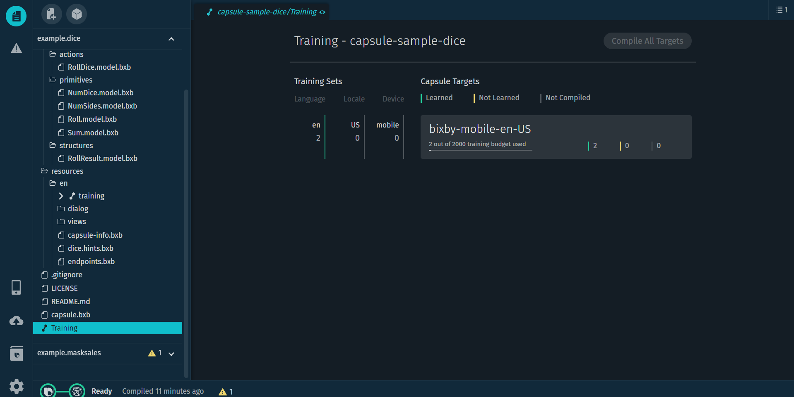
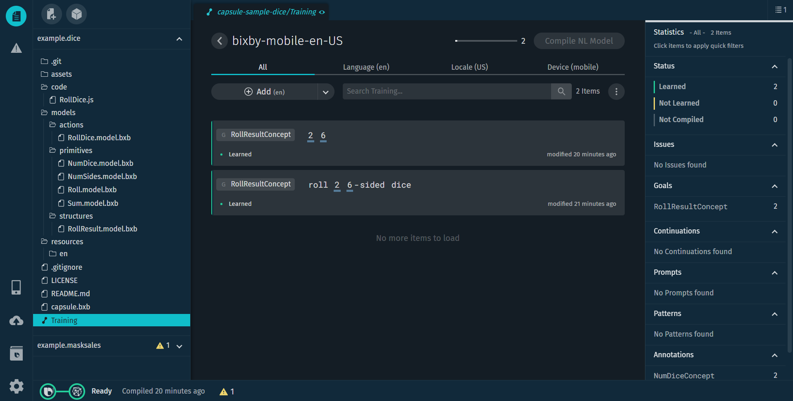

# Training

### 발화(utterance)

빅스비는 자연어(Natural Language) 처리를 수행. 사용자의 "2면 주사위 3개 굴려줘"와 같은 발화를 처리한다. 문법적일 필요는 없고, 속어나 구어를 포함할 수 있다. 빅스비는 발화와 같은 **비구조화된 자연어를 구조화된 intent로 변경하여 plan**을 만든다.

### Training Sets와 Capsule Targets

- A specific language, for any locale or any device: `en`
- A specific language and locale, for any device: `en-US`
- A specific language and a specific device, for any locale: `bixby-mobile-en`
- A specific language, locale, and device: `bixby-mobile-en-US`

### Training Entry List

- goal
- utterance and value highlighted
- entry's training status

### Adding training

For each training entry, you'll:

1. [Set a goal](https://bixbydevelopers.com/dev/docs/dev-guide/developers/training.training-for-nl#set-a-goal) for the utterance
   - Goals are usually concepts
   - Sometimes, goals might be actions(ex. when the user is purchasing a product or a service in a transaction)
2. [Identify values](https://bixbydevelopers.com/dev/docs/dev-guide/developers/training.training-for-nl#identify-values) in the example's utterance
   - To reach a goal, Bixby often needs input values
   - The values you annotate in an utterance should match primitive concepts, not structure concepts. If you need a structure concept as an input for an action, create a [Constructor](https://bixbydevelopers.com/dev/docs/reference/type/action.type#constructor) that takes the primitive concepts that match the properties of the structure concept as inputs, and outputs the structure concept. See the [Constructor documentation](https://bixbydevelopers.com/dev/docs/reference/type/action.type#constructor) for an example.
3. [Verify the plan](https://bixbydevelopers.com/dev/docs/dev-guide/developers/training.training-for-nl#verify-the-plan) that Bixby creates for the example

### Specializations

#### Continuation Of

앞에 상황과 이어지는 질문을 하거나 수정이 필요한 경우 사용. (ex. "M사이즈 셔츠 구매" 다음에 이어지는 "L사이즈로 변경") 이러한 발화를 스스로 이해하지 못하는 경우에 발화를 continuation 훈련 가능.

continuation은 routes의 일반적인 사용이다.

Read about [Routes](https://bixbydevelopers.com/dev/docs/dev-guide/developers/training.training-for-nl#routes) for more information (and alternatives to using routes). In addition, read about [Adding Context with Roles](https://bixbydevelopers.com/dev/docs/dev-guide/developers/training.training-for-nl#adding-context-with-roles) for more information.

#### At Prompt For

"사이즈를 small로 변경해줘"와 같은 적절한 input이 충분한 발화가 아닌, "사이즈를 변경해줘"와 같이 구체적인 데이터가 없는 발화는 빅스비가 input을 받기 위해서 되물을 수 있다. 이에 대한 값을 받을 수 있다. 사이즈와 같은 값은 고정된 값이 될 수 있으므로, form값으로 입력되는 건지 확인할 필요가 있다.

#### Pattern For

Patterns provide [vocabulary](https://bixbydevelopers.com/dev/docs/dev-guide/developers/training.vocabulary) for structured concepts.(ex. 날짜, 시간을 표현을 학습하기 위해서 viv.time 라이브러리를 쓰는데, 이 때 우리는 viv.time.DateTimeExpression을 사용해 훈련하면 된다. training이 DateTimeExpression concept에 매핑된 패턴으로 구성되기 때문.(?)) The patterns are all variations of ways people could refer to `DateTime` objects.

### extends

### Roles

### Routes

### Flags

