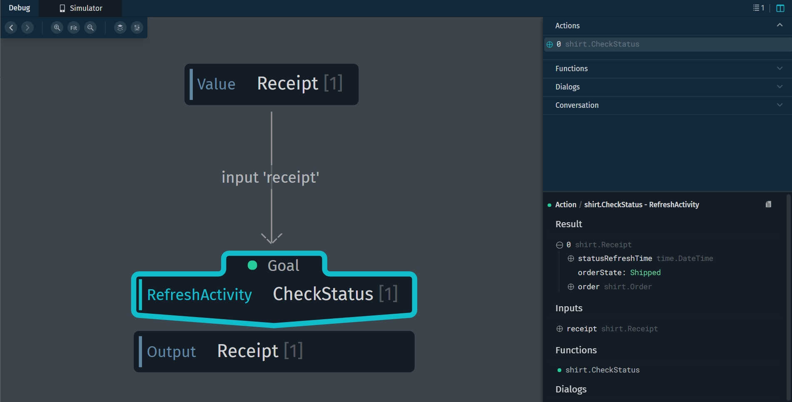

# Transaction

## 트랜잭션이 무엇인가?

하나의 논리적 기능을 수행하기 위한 단위

### ACID

- 원자성(Atomicity) : 하나의 트랜잭션 연산은 완전히 수행되거나, 수행되지 않아야 한다. 즉 트랜잭션과 관련된 작업들이 부분적으로 실행되다가 중단되지 않는 것을 보장한다.
- 일관성(Consistency) : 트랜잭션이 실행을 성공적으로 완료하면 언제나 일관성 있는 데이터베이스 상태로 유지한다.
- 격리성(Isolation) : 트랜잭션이 수행 시 다른 트랜잭션의 연산 작업이 끼어들지 못하도록 보장한다.
- 영속성(Durability) : 성공적으로 수행된 트랜잭션은 영원히 반영되어야 한다. 전형적으로 모든 트랜잭션은 로그에 남고, 트랜잭션은 로그에 모든 것이 저장된 후에만 commit 상태로 간주될 수 있다.


## Bixby에서의 Transaction

- 주문과 같은 시나리오를 지원하기 위한 Bixby feature
- 장바구니 처리(추가/변경)과 같은 기능 구현 가능
- 식당 예약, 커피 주문, 이메일 보내기(주문과 동떨어지지만 트랜잭셔널하게 활용할 수 있는 것) 등과 같은 시나리오에 적용 가능


### 트랜잭션 워크플로우


- Order 컨셉 안에 feature로 트랜잭션을 갖고 있는 것인지, activity를 갖고 있는 것인지 이러한 요소를 갖고 있는 **컨셉이 전체 플로우의 핵심**

- shirt 구매의 workflow
  - shirt.CreateOrder : 사용자에게 어떤 색깔, 사이즈, 금액, 개수의 셔츠를 살 것인지 묻는 부분.
  - shirt.UpdateOrder : 사용자의 최종적으로 구매를 누르기 전에 발생하는 변경사항을 반영하기 위한 부분.
  - shirt.CommitOrder : 구매해줘.
  - shirt.CancelOrder : 취소해줘.
  - shirt.Receipt : 구매해줘의 결과로 영수증을 유저에게 보여주는데, 이에 대한 데이터를 Receipt에 넣을 것.
  - shirt.CheckStatus : 내가 주문한 물품에 대한 정보가 궁금할 때. 몇개 샀지? 뭐샀지? 이런걸 받아주는 발화.


### Transaction Type

주문이 일어나기 전 상황을 Transaction, 주문이 일어난 후를 activity라 한다.


- ArchiveLookup은 유저가 이전에 주문한 기록을 확인하기 위해 RefreshActivity를 할 때, 유저의 device에 저장된 기록을 불러오기 위해서 먼저 수행되어야 한다.


### Prompt-behavior


#### AlwaysSelection과 AlwaysElicitation의 차이

AlwaysSelection은 유저가 **값을 확인 or 선택**하는 것. AlwaysElicitation은 유저가 **값을 제공하도록 강제**하는 것. 타이핑을 하든지, 말을 하든지 꼭 받아야 한다!


#### Transaction/Activity-support


shirt transaction을 예로, Transaction-support의 concept는 order, Activity-support의 concept는 receipt.


## Shirt를 구매하는 예제를 통해 깊게 이해해보자!

- goal로 action이 올 수 있음을 알아야 한다.(어떤 의미임..?)
  : 결과적으로 만들어지는 output의 concept은 다르거나 동일할 수 있는데, 이 때 goal로 action을 직접 지정하면 원하는 동작을 수행하도록 하는 것이 가능해지기 때문?


#### Confirmation View

commitOrder에서 해당 confirmation 요소를 넣을 경우 나오는 화면

- 수량, 사이즈를 수정 가능 - updateTransaction 타입의 액션을 수행
- yes를 누르면 commitOrder 실행, no를 누르면 cancelTransaction 타입을 가진 액션이 실행


트랜잭션이 끝난 후의 상황은 **Activity**

**어떤 다른 행동을 하다가도 Activity가 있기 때문**에, 내 셔츠 어때? 물어보면 적절히 동작한다.

- RefreshActivity 를 타입으로 갖는 CheckStatus라는 액션이 실행된다.
- 빅스비 플랫폼에 저장돼 있는 내 주문이 불러와진 것을 확인 가능.




### CommitOrder Training


- 하나의 완벽한 CommitOrder를 만들기 위해 알아야 하는 정보인 옷의 종류, 사이즈, 개수 등의 정보를 알아가기 위한 과정 중에서 **route**가 반드시 필요. route에는 이를 처리해주기 위한 action들이 들어간다. route가 중첩될 경우, 맨 밑에 있는 게 가장 먼저 실행. 
  현재 최신의 shirt 예제에는 route가 없다. transaction의 동작 때문인지, 무엇 때문인지 route가 없어도 되는 이유를 찾아봐야할 것.

#### 

### CommitOrder


#### Confirmation

사용자에게 이 주문이 맞는지 최종 확인하는 요소. 소스에는 core.Confirmation이라고 되어 있는데, Confirmation view를 만들어서 아래와 같이 동작하도록 구현을 해야하는 것 같다.

```
confirmation-view {
	match {
		core.Confirmation {
			confirming {
				CommitOrder (action)
			}
		}
	}
	
	message ("Are you sure you want to buy this?")
	
	mode (Transactional)
	
	render {
		layout-macro (CommitOrder_Section) {
			param (commitOrder) {
				expression (action)
			}
		}
	}
}
```

#### Confirming

This is a special link type used for matching [confirmation views](https://bixbydevelopers.com/dev/docs/reference/type/confirmation-view.match). The parent of a `confirming` link is usually a concept that extends `viv.core.Confirmation`, a boolean set to `true` if the user has confirmed the linked action; `confirming` specifies which action has been confirmed.

In this example, this match pattern for a `confirmation-view` matches confirmations for the `CommitOrder` transaction:

```bxb
    match {
        core.Confirmation {
            confirming {
                CommitOrder (action)
            }
        }
    }
```


#### on-click 구문 처리하는 방법

- 내부 intent를 통해 goal과 필요한 값들을 통해 설정할 수 있다.

```
split-input-cell {
    left {
        input-cell {
            label ("Quantity")
            value ("#{value(item.quantity)}")
            on-click {
                //This intent relies on searchTerm matching the item which is not a good practice, a better approach
                //was to allow an ID as input to SelectItem and use `this.id` in the intent
                intent {
                    goal {
                        CommitOrder
                        @context (Continuation) { Order }
                    }
                    value { SearchTerm$expr(item.shirt.title) }
                    route { UpdateOrder }
                    route { GetQuantity }
                }
            }
        }
    }
    right {
        input-cell {
            label ("Size")
            value ("#{value(item.size)}")
            on-click {
                // This intent relies on searchTerm matching the item which is not a good practice, a better approach
                // was to allow an ID as input to SelectItem and use `this.id` in the intent
                intent {
                    goal {
                        CommitOrder
                        @context (Continuation) { Order }
                    }
                    value { SearchTerm$expr(item.shirt.title) }
                    route { UpdateOrder }
                    route { GetSize }
                }
            }
        }
    }
}
```


### CreateOrder

```
action (CreateOrder) {
  type (BeginTransaction)
  collect {
    input (initialItems) {
      type (InitialItems)
      min (Required)
      max (One)
      default-init {
        intent: goal: CreateItems
      }
    }
  }
  output (Order)
}
```


### UpdateOrder

**type : UpdateTransaction**

- input으로 기존의 데이터를 받는다.

- input-group으로 변경될 item들을 받아 업데이트 해준다.

```
action (UpdateOrder) {
  type (UpdateTransaction)
  collect {
    //the order that is updated
    input (order) {
      type (Order)
      min (Required)
    }
    input-group (updates){
      requires (OneOrMoreOf)
      collect {
        input (addedItems) {
          type (AddedItems)
          min (Optional)
          max (One)
        }
        input (changedItems) {
          type (ChangedItems)
          min (Optional)
          max (One)
        }
        input (removedItems) {
          type (RemovedItems)
          min (Optional)
          max (One)
        }
      }
    }
  }
  //returns the updated order
  output (Order) {
    throws {

       error(NoItems) {
        on-catch {
          halt {
            dialog {
              template-macro (NoItemsInCart)
            }
          }
        }
      }
    }
  }
}

```


### CancelOrder

```
action (CancelOrder) {
  type (CancelTransaction)
  collect {
    input (order) {
      type (Order)
      min (Optional)
      validate {
        if (!exists(order)) {
          halt {
            dialog {
              template ("Okay.")
            }
          }
        }
      }
    }
  }
  output (Receipt)
}
```


### Order

- transaction의 핵심이 되는 부분.
- features에 transaction이라고 명시하는 것으로 이 컨셉이 가장 중요한 핵심 컨셉이다, 이 컨셉을 위주로 트랜잭션이 흘러간다라 선언한 것.

```
structure (Order) {
  property (items) {
    type (Item)
    min (Optional)
    max (Many)
  }
  property (orderNumber) {
    type (OrderNumber)
    min (Required)
  }
  property (totalPrice) {
    type (Price)
    min (Required)
  }
  property (holdTime) {
    type (HoldTime)
    min (Required)
  }
  features {
    transaction
  }
}
```


### Receipt

- features에 activity.
- 이 Receipt 컨셉으로 액티비티에서 모든 행동을 취하겠다.

```
structure (Receipt) {
  property (order) {
    type (Order)
    min (Required)
    max (Many)
  }
  property (orderState) {
    type (OrderState)
    min (Required)
  }
  property(statusRefreshTime) {
    type(time.DateTime)
    visibility(Private)
    min (Optional)
  }
  features {activity}
}
```


### 빅스비 플랫폼에 저장된 activity 데이터 불러오기

#### CheckStatus

```
action (CheckStatus) {
  type (RefreshActivity)
  collect {
    input (receipt) {
      type (Receipt)
      min (Required)
      default-init {
        intent {
          goal: FindLastReceipt
        }
      }
    }
  }
  output (Receipt)
}
```


#### CheckStatus.js

```javascript
var dates = require('dates')
var config = require('config')
//CheckStatus
exports.function = function (receipt) {
  // These conditions are here to simulate the order being shipped and delivered.
  // The first time a Check Status is run, this order will be Shipped, and then the next time it will be Delivered, and stay that way.

  if (receipt) {
    if (receipt.orderState == "Ordered") {
      receipt.orderState = "Shipped"
    } else if (receipt.orderState == "Shipped") {
      receipt.orderState = "Delivered"
    }
    receipt.statusRefreshTime = dates.ZonedDateTime.now().plusSeconds(parseInt(config.get("status_refresh_time"))).getDateTime()
  }
  return receipt
}

```


#### FindLastReceipt

```
action (FindLastReceipt) {
  output (Receipt)
  type (ArchiveLookup)
}
```


#### FindLastReceipt.js

```javascript
var transaction = require('transaction')
// FindLastReceipt
exports.function = function() {
    //look up last receipt from viv cloud
    return transaction.retrieve("example.shirt.Receipt", "ALL", 1)
}
```


## transaction/activity-support

유저와의 상호작용에서 어떻게 transaction/activity가 반응할지.

- 주문을 중단할 때, 중단한 주문을 얼마동안 가지고 있을지,
- 액티비티 상황에서, orderState의 상태에 따라, 주문서가 어떻게 데이터가 변하고 이 주문서를 유저에게 어떻게 보여줄지를 정의하는 부분.