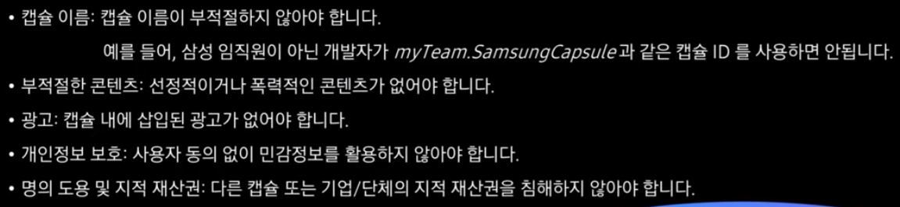
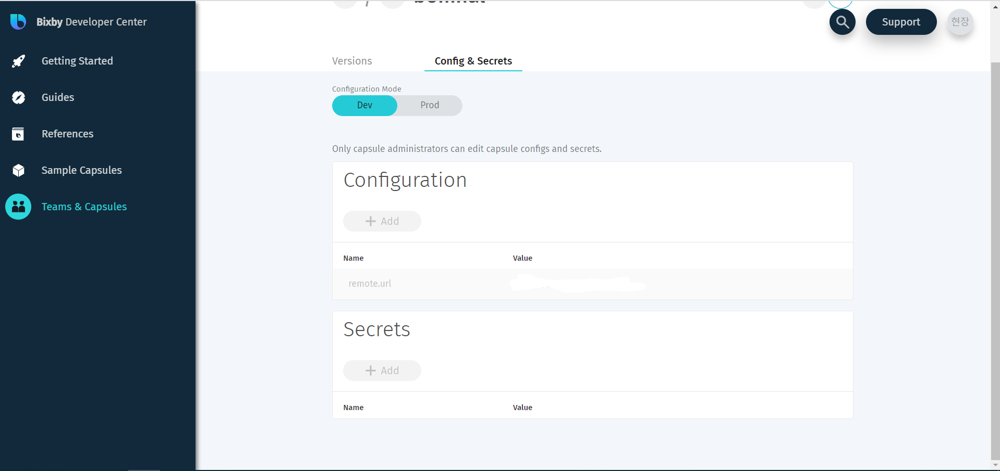

# 배포

### capsule.bxb 체크

캡슐의 버전, 지원 언어와 디바이스, 마켓플레이스의 호환 국가와 디바이스 설정 가능

1. 캡슐의 버전 확인
   - 제출을 할 때마다 버전을 높여야 한다.
2. 지원 언어와 디바이스 설정
   - 기본 설정 언어는 영어, 미국, 기본설정 디바이스는 모바일로 잡혀 있다.
   - 우리는 언어는 한국, 한국어, 모바일로 하자.
3. 마켓 플레이스에 오픈될 경우의 섹션 설정
   - 최소 한 개 이상의 섹션을 설정해야 한다.
   - 캡슐의 기능과 지원되는 발화의 적합한 섹션. 그렇지 않을 경우 배포 승인 거절될 수 있음
   - https://bixbydevelopers.com/dev/docs/reference/type/capsule.store-sections

### capsule-info.bxb 파일 생성

```
capsule-info {
    display-name (날씨알리미) // 사용자에게 보이는 고유한 캡슐 이름
    // https://bixbydevelopers.com/dev/docs/reference/type/capsule-info.dispatch-name 참고
    
    developer-name (주식회사 날씨알리미) // 캡슐 개발자 이름(개발자나 개발팀 고유 이름)
    icon-asset (/images/icons/example.png) // 캡슐 로고 파일 경로(200x200)
    description (날씨알리미는 여러분의 주변 동네 날씨정보를 제공합니다.)
    website-url (https://www.example.com) // 캡슐 정보에 표기되는 웹사이트 
    terms-url (https://www.example.com/TOS.html) // terms and conditions
    privacy-policy-url (https://www.example.com/privacy.html) // 사용자 개인정보를 사용할 경우, 개인정보를 활용 동의하기 위한 url을 반드시 추가해야 한다.
    search-keywords { // 사용자가 마켓에서 쉽게 찾을 수 있도록 검색 키워드 작성. 반드시 1개 이상 최대 10개까지 
    	keyword (날씨정보)
    	keyword (주변날씨)
    }
    dispatch-name (날씨알리미) // 사용자가 부르는 캡슐의 이름
    dispatch-aliases { // 사용자가 부를 법한, 어떻게 다르게 들릴지를 고려하여 추가하기
    	alias (날씨알림이)
    }
}
```

#### 빅스비가 사용자 발화를 실행하는 두 가지 방법

1. dispatch-name으로 지정한 명목 + 발화를 받아 시행

   ex) "날씨알리미에서 오늘 날씨 알려줘"

2. NL Category 운영
   - 캡슐 이름 간 발화 충돌 방지, 사용 편의성 증대
   - "날씨 알려줘"란 발화가 특정 NL Category에 속하고, 사용자가 이 발화를 사용하는 날씨알리미 캡슐을 해당 NL Category에 default 캡슐로 선택한다면, 사용자가 dispatch-name 없이 발화만으로 동작 가능.


## 테스트

- hint를 통해 사용자에게 추천 발화를 제공

- 최소 3개의 힌트 필요
- /resources/*.hints.bxb
- dispatch-name을 적지 마롸

```
hints {
	uncategorized {
		utterance (오늘 날씨 알려줘)
		utterance (오늘 강수량이 어때)
	}
}
```

https://bixbydevelopers.com/dev/docs/dev-guide/developers/testing.on-device 참고


### 마켓플레이스 캡슐 정책 준수




### Capsule Configuration

endpoint URIs, API keys, permission scopes, environment modes, or any other configuration data

두 가지 방법을 통해 설정 가능

- capsule.properties 파일 설정(캡슐 내)
- 빅스비 디벨로퍼 팀 페이지의 Config & Secrets 탭에서 적용 가능

#### Config & Secrets



- Dev(Development) : simulator를 사용할 때 쓰이는 정보 저장
- Prod(Production) : on-device testing and on Marketplace에서 쓰이는 정보 저장


아래와 같이 사용할 수 있다.

```javascript
var config = require('config');
var secret = require('secret');
var configValue = config.get('myConfigKey');
var secretValue = secret.get('mySecretKey');
```


## 번외

### release, deploy, distribute의 차이

- release
  : 같은 제품을 새롭게 만든다.
- deploy
  : 소프트웨어를 사용할 수 있게 WAS 등에 올리는 것.
- distribute
  : 사용자들이 사용할 수 있도록 서비스를 제공하는 것.

